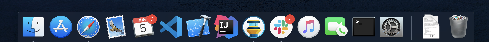

# How to set up a fresh Mac the way I like it

Here's a simple list of steps to set up a Mac the way I like it. My setup is pretty simple except for my very specific trackpad settings.

## Password Manager

- [ ] Install 1Password [here](https://1password.com/downloads/mac/)
- [ ] Set up 1Password using QR code from phone

## Settings

### Trackpad

- [ ] Enable Tap to Click
- [ ] Set Secondary Click to `Click in bottom right corner`
- [ ] Set Tracking Speed to Fast
- [ ] Enable three finger drag:
	- It's hidden in Accessibility > Pointer Control > Trackpad Speed

### Dock

- [ ] Disable `Show recent applications in Dock`

### Desktop

- [ ] Use stacks

### Menu Bar

- [ ] Get rid of keyboard icon
- [ ] Add volume icon (to be able to change output quickly)
- [ ] Show battery percentage

### Safari

- [ ] Enable developer tools
	- It's in Advanced > Show Develop Menu in Menu Bar

## Terminal

- [ ] Install Xcode CLI tools
	- `xcode-select --install`
- [ ] Install Homebrew
	- `/bin/bash -c "$(curl -fsSL https://raw.githubusercontent.com/Homebrew/install/master/install.sh)"`
- Set up zsh
	- [ ] Install zsh
		- `brew install zsh`
	- [ ] Install oh-my-zsh 
		- `sh -c "$(curl -fsSL https://raw.githubusercontent.com/robbyrussell/oh-my-zsh/master/tools/install.sh)"`
	- [ ] Run `upgrade_oh_my_zsh`
	- [ ] Download Powerline9K Theme 
		- `git clone https://github.com/bhilburn/powerlevel9k.git ~/.oh-my-zsh/custom/themes/powerlevel9k`
	- [ ] Install a compatible font from the [repo](https://github.com/powerline/fonts).
		- You were last using Inconsolata
	- [ ] Set font in terminal to compatible font
	- [ ] Download .zshrc from the Password Manager 
		- *note: you don't need to store these in your Password Manager. I just put them there while I was storing my ssh keys there. Git is propbably a better choice for this. I just did it this way*
- [ ] Download ssh keys from the Password Manager
- [ ] Download .vimrc from the Password Manager
- [ ] Download global .gitignore from the Password Manager

## Apps

- [ ] Install Xcode from the App Store
	- [ ] Enable Trimming of blank lines in Text Editing > Editing > While Editing
	- [ ] Set command click to jump to definition in Navigation > Command Click on Code
	- And to save you the trouble of debugging this for the millionth time:
		- [ ] Run `sudo xcode-select -s /Applications/Xcode.app/Contents/Developer`
- Install software from the Mac App Store
	- [ ] Slack
	- [ ] Telegram
	- [ ] AdGuard for Safari
	- [ ] Grammarly for Safari
- Install software from Homebrew (Alfred, Sequel Pro, VSCode, MacDown, GitTower, jetBrains Toolbox, Docker, Chrome (just in case), WhatsApp, Discord, Steam, LaTeX)
	- `brew bundle`
- Setup Alfred.
 	- [ ] Set Spotlight Shortcut to something else
 	- [ ] Set Alfred Shortcut to ⌘ + Space
 	- [ ] Turn on Clipboard History
 	- [ ] Hide hat on Window
 	- [ ] Hide menu bar icon
	- [ ] Set up bunnylol as a search engine
- [ ] Add the LaTeX Workshop plugin for VS Code
- [ ] Install IntelliJ via JetBrains ToolBox
- [ ] Install NodeJS and NPM from [here](https://nodejs.org/).

## Rearrange Dock

Rearrange the Apps you want on the dock, however you like.
As a reference this is my Dock right now:

